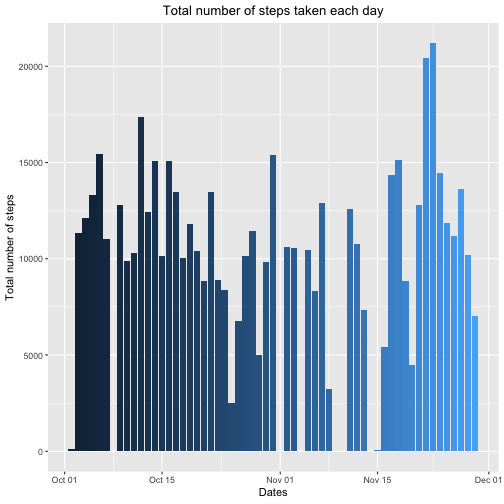
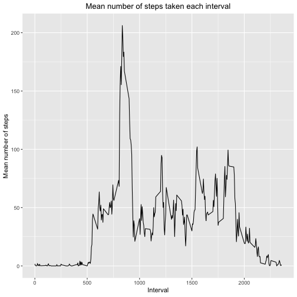
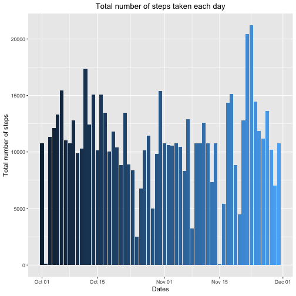
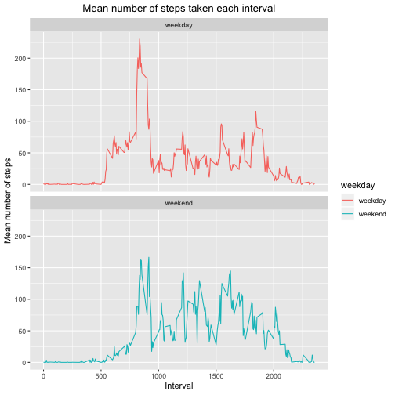

Reproducible Research Course Project 1
======================================

### 1. Code for reading in the dataset and/or processing the data

##### 1.1 Load the data


```r
# Download zip file

url<-"https://d396qusza40orc.cloudfront.net/repdata%2Fdata%2Factivity.zip"
zfile<-file.path(getwd(), "activity.zip")

if(!file.exists(zfile)){
	download.file(url, destfile=zfile, method="curl")
}

# Unzip file

file<-file.path(getwd(), "activity.csv")
if(!file.exists(file)){
	unzip(zfile)
}

# Read file and processing

activity<-read.csv("activity.csv", na.strings="NA", stringsAsFactors=FALSE)
```

##### 1.2 Process/transform the data (if necessary) into a format suitable for your analysis


```r
activity$date<-as.Date(activity$date, "%Y-%m-%d")
```


### 2. Histogram of the total number of steps taken each day

##### 2.1 Calculate the total number of steps taken per day


```r
require(dplyr)

total.steps.day<-activity %>% group_by(date) %>% summarise(total.steps.day=sum(steps), na.rm=T)
```

##### 2.2 Make a histogram of the total number of steps taken each day


```r
require(ggplot2)

ggplot(data=total.steps.day, aes(x=date, y=total.steps.day, fill=date)) + geom_histogram(stat = "identity") + labs(x="Dates", y="Total number of steps")+ ggtitle("Total number of steps taken each day") + theme(plot.title = element_text(hjust = 0.5), legend.position="none")
```



### 3. Mean and median number of steps taken each day


```r
require(xtable)

steps.day_MEAN<-activity %>% group_by(date) %>% summarise(mean.steps.day=mean(steps, na.rm=T))

#For the median these strategies does not work
#steps.day_MEDIAN<-activity %>% group_by(date) %>% summarise(median.steps.day=median(as.numeric(steps), na.rm=T))
#aggregate(steps ~ date, data = activity, FUN = median)

steps.day_MEAN$date<-as.character(steps.day_MEAN$date)

table.mean<-xtable(steps.day_MEAN)
print(table.mean,type="html")
```

<!-- html table generated in R 3.5.0 by xtable 1.8-3 package -->
<!-- Tue Oct 23 18:53:28 2018 -->
<table border=1>
<tr> <th>  </th> <th> date </th> <th> mean.steps.day </th>  </tr>
  <tr> <td align="right"> 1 </td> <td> 2012-10-01 </td> <td align="right">  </td> </tr>
  <tr> <td align="right"> 2 </td> <td> 2012-10-02 </td> <td align="right"> 0.44 </td> </tr>
  <tr> <td align="right"> 3 </td> <td> 2012-10-03 </td> <td align="right"> 39.42 </td> </tr>
  <tr> <td align="right"> 4 </td> <td> 2012-10-04 </td> <td align="right"> 42.07 </td> </tr>
  <tr> <td align="right"> 5 </td> <td> 2012-10-05 </td> <td align="right"> 46.16 </td> </tr>
  <tr> <td align="right"> 6 </td> <td> 2012-10-06 </td> <td align="right"> 53.54 </td> </tr>
  <tr> <td align="right"> 7 </td> <td> 2012-10-07 </td> <td align="right"> 38.25 </td> </tr>
  <tr> <td align="right"> 8 </td> <td> 2012-10-08 </td> <td align="right">  </td> </tr>
  <tr> <td align="right"> 9 </td> <td> 2012-10-09 </td> <td align="right"> 44.48 </td> </tr>
  <tr> <td align="right"> 10 </td> <td> 2012-10-10 </td> <td align="right"> 34.38 </td> </tr>
  <tr> <td align="right"> 11 </td> <td> 2012-10-11 </td> <td align="right"> 35.78 </td> </tr>
  <tr> <td align="right"> 12 </td> <td> 2012-10-12 </td> <td align="right"> 60.35 </td> </tr>
  <tr> <td align="right"> 13 </td> <td> 2012-10-13 </td> <td align="right"> 43.15 </td> </tr>
  <tr> <td align="right"> 14 </td> <td> 2012-10-14 </td> <td align="right"> 52.42 </td> </tr>
  <tr> <td align="right"> 15 </td> <td> 2012-10-15 </td> <td align="right"> 35.20 </td> </tr>
  <tr> <td align="right"> 16 </td> <td> 2012-10-16 </td> <td align="right"> 52.38 </td> </tr>
  <tr> <td align="right"> 17 </td> <td> 2012-10-17 </td> <td align="right"> 46.71 </td> </tr>
  <tr> <td align="right"> 18 </td> <td> 2012-10-18 </td> <td align="right"> 34.92 </td> </tr>
  <tr> <td align="right"> 19 </td> <td> 2012-10-19 </td> <td align="right"> 41.07 </td> </tr>
  <tr> <td align="right"> 20 </td> <td> 2012-10-20 </td> <td align="right"> 36.09 </td> </tr>
  <tr> <td align="right"> 21 </td> <td> 2012-10-21 </td> <td align="right"> 30.63 </td> </tr>
  <tr> <td align="right"> 22 </td> <td> 2012-10-22 </td> <td align="right"> 46.74 </td> </tr>
  <tr> <td align="right"> 23 </td> <td> 2012-10-23 </td> <td align="right"> 30.97 </td> </tr>
  <tr> <td align="right"> 24 </td> <td> 2012-10-24 </td> <td align="right"> 29.01 </td> </tr>
  <tr> <td align="right"> 25 </td> <td> 2012-10-25 </td> <td align="right"> 8.65 </td> </tr>
  <tr> <td align="right"> 26 </td> <td> 2012-10-26 </td> <td align="right"> 23.53 </td> </tr>
  <tr> <td align="right"> 27 </td> <td> 2012-10-27 </td> <td align="right"> 35.14 </td> </tr>
  <tr> <td align="right"> 28 </td> <td> 2012-10-28 </td> <td align="right"> 39.78 </td> </tr>
  <tr> <td align="right"> 29 </td> <td> 2012-10-29 </td> <td align="right"> 17.42 </td> </tr>
  <tr> <td align="right"> 30 </td> <td> 2012-10-30 </td> <td align="right"> 34.09 </td> </tr>
  <tr> <td align="right"> 31 </td> <td> 2012-10-31 </td> <td align="right"> 53.52 </td> </tr>
  <tr> <td align="right"> 32 </td> <td> 2012-11-01 </td> <td align="right">  </td> </tr>
  <tr> <td align="right"> 33 </td> <td> 2012-11-02 </td> <td align="right"> 36.81 </td> </tr>
  <tr> <td align="right"> 34 </td> <td> 2012-11-03 </td> <td align="right"> 36.70 </td> </tr>
  <tr> <td align="right"> 35 </td> <td> 2012-11-04 </td> <td align="right">  </td> </tr>
  <tr> <td align="right"> 36 </td> <td> 2012-11-05 </td> <td align="right"> 36.25 </td> </tr>
  <tr> <td align="right"> 37 </td> <td> 2012-11-06 </td> <td align="right"> 28.94 </td> </tr>
  <tr> <td align="right"> 38 </td> <td> 2012-11-07 </td> <td align="right"> 44.73 </td> </tr>
  <tr> <td align="right"> 39 </td> <td> 2012-11-08 </td> <td align="right"> 11.18 </td> </tr>
  <tr> <td align="right"> 40 </td> <td> 2012-11-09 </td> <td align="right">  </td> </tr>
  <tr> <td align="right"> 41 </td> <td> 2012-11-10 </td> <td align="right">  </td> </tr>
  <tr> <td align="right"> 42 </td> <td> 2012-11-11 </td> <td align="right"> 43.78 </td> </tr>
  <tr> <td align="right"> 43 </td> <td> 2012-11-12 </td> <td align="right"> 37.38 </td> </tr>
  <tr> <td align="right"> 44 </td> <td> 2012-11-13 </td> <td align="right"> 25.47 </td> </tr>
  <tr> <td align="right"> 45 </td> <td> 2012-11-14 </td> <td align="right">  </td> </tr>
  <tr> <td align="right"> 46 </td> <td> 2012-11-15 </td> <td align="right"> 0.14 </td> </tr>
  <tr> <td align="right"> 47 </td> <td> 2012-11-16 </td> <td align="right"> 18.89 </td> </tr>
  <tr> <td align="right"> 48 </td> <td> 2012-11-17 </td> <td align="right"> 49.79 </td> </tr>
  <tr> <td align="right"> 49 </td> <td> 2012-11-18 </td> <td align="right"> 52.47 </td> </tr>
  <tr> <td align="right"> 50 </td> <td> 2012-11-19 </td> <td align="right"> 30.70 </td> </tr>
  <tr> <td align="right"> 51 </td> <td> 2012-11-20 </td> <td align="right"> 15.53 </td> </tr>
  <tr> <td align="right"> 52 </td> <td> 2012-11-21 </td> <td align="right"> 44.40 </td> </tr>
  <tr> <td align="right"> 53 </td> <td> 2012-11-22 </td> <td align="right"> 70.93 </td> </tr>
  <tr> <td align="right"> 54 </td> <td> 2012-11-23 </td> <td align="right"> 73.59 </td> </tr>
  <tr> <td align="right"> 55 </td> <td> 2012-11-24 </td> <td align="right"> 50.27 </td> </tr>
  <tr> <td align="right"> 56 </td> <td> 2012-11-25 </td> <td align="right"> 41.09 </td> </tr>
  <tr> <td align="right"> 57 </td> <td> 2012-11-26 </td> <td align="right"> 38.76 </td> </tr>
  <tr> <td align="right"> 58 </td> <td> 2012-11-27 </td> <td align="right"> 47.38 </td> </tr>
  <tr> <td align="right"> 59 </td> <td> 2012-11-28 </td> <td align="right"> 35.36 </td> </tr>
  <tr> <td align="right"> 60 </td> <td> 2012-11-29 </td> <td align="right"> 24.47 </td> </tr>
  <tr> <td align="right"> 61 </td> <td> 2012-11-30 </td> <td align="right">  </td> </tr>
   </table>

### 4. Time series plot of the average number of steps taken


```r
interval.steps<-activity %>% group_by(interval) %>% summarise(interval.steps=mean(steps, na.rm=T))

ggplot(data=interval.steps, aes(x=interval, y=interval.steps,group=1)) + geom_line() + labs(x="Interval", y="Mean number of steps") + ggtitle("Mean number of steps taken each interval") + theme(plot.title = element_text(hjust = 0.5), legend.position="none")
```



### 5. The 5-minute interval that, on average, contains the maximum number of steps


```r
interval.max<-interval.steps[interval.steps$interval.steps==max(interval.steps$interval.steps),]

interval.max.table<-xtable(interval.max)
print(interval.max.table,type="html")
```

<!-- html table generated in R 3.5.0 by xtable 1.8-3 package -->
<!-- Tue Oct 23 18:53:29 2018 -->
<table border=1>
<tr> <th>  </th> <th> interval </th> <th> interval.steps </th>  </tr>
  <tr> <td align="right"> 1 </td> <td align="right"> 835 </td> <td align="right"> 206.17 </td> </tr>
   </table>

### 6. Code to describe and show a strategy for imputing missing data

##### 6.1 Calculate and report the total number of missing values in the dataset


```r
total.NAs<-sum(is.na(activity$steps))
total.NAs
```

```
## [1] 2304
```

##### 6.2 Devise a strategy for filling in all of the missing values in the dataset


```r
imputed.steps <- interval.steps$interval.steps[match(activity$interval, interval.steps$interval)]
```

##### 6.3 Create a new dataset that is equal to the original dataset but with the missing data filled in


```r
activity.impute<-transform(activity, steps=ifelse(is.na(activity$steps), yes=imputed.steps, no=activity$steps))

activity.impute$date<-as.Date(activity$date,"%Y-%m-%d")
```


### 7. Histogram of the total number of steps taken each day after missing values are imputed

##### 7.1 Make a histogram of the total number of steps taken each day


```r
total.steps.day.impute<-activity.impute %>% group_by(date) %>% summarise(total.steps.day=sum(steps), na.rm=T)

ggplot(data=total.steps.day.impute, aes(x=date, y=total.steps.day, fill=date)) + geom_histogram(stat = "identity") + labs(x="Dates", y="Total number of steps") + ggtitle("Total number of steps taken each day") + theme(plot.title = element_text(hjust = 0.5), legend.position="none")
```



##### 7.2 Calculate and report the mean and median total number of steps taken per day


```r
steps.day.impute_MEAN<-activity.impute %>% group_by(date) %>% summarise(mean.steps.day=mean(steps, na.rm=T))

steps.day.impute_MEAN$date<-as.character(steps.day.impute_MEAN$date)

table.mean.impute<-xtable(steps.day.impute_MEAN)
print(table.mean.impute,type="html")
```

<!-- html table generated in R 3.5.0 by xtable 1.8-3 package -->
<!-- Tue Oct 23 18:53:30 2018 -->
<table border=1>
<tr> <th>  </th> <th> date </th> <th> mean.steps.day </th>  </tr>
  <tr> <td align="right"> 1 </td> <td> 2012-10-01 </td> <td align="right"> 37.38 </td> </tr>
  <tr> <td align="right"> 2 </td> <td> 2012-10-02 </td> <td align="right"> 0.44 </td> </tr>
  <tr> <td align="right"> 3 </td> <td> 2012-10-03 </td> <td align="right"> 39.42 </td> </tr>
  <tr> <td align="right"> 4 </td> <td> 2012-10-04 </td> <td align="right"> 42.07 </td> </tr>
  <tr> <td align="right"> 5 </td> <td> 2012-10-05 </td> <td align="right"> 46.16 </td> </tr>
  <tr> <td align="right"> 6 </td> <td> 2012-10-06 </td> <td align="right"> 53.54 </td> </tr>
  <tr> <td align="right"> 7 </td> <td> 2012-10-07 </td> <td align="right"> 38.25 </td> </tr>
  <tr> <td align="right"> 8 </td> <td> 2012-10-08 </td> <td align="right"> 37.38 </td> </tr>
  <tr> <td align="right"> 9 </td> <td> 2012-10-09 </td> <td align="right"> 44.48 </td> </tr>
  <tr> <td align="right"> 10 </td> <td> 2012-10-10 </td> <td align="right"> 34.38 </td> </tr>
  <tr> <td align="right"> 11 </td> <td> 2012-10-11 </td> <td align="right"> 35.78 </td> </tr>
  <tr> <td align="right"> 12 </td> <td> 2012-10-12 </td> <td align="right"> 60.35 </td> </tr>
  <tr> <td align="right"> 13 </td> <td> 2012-10-13 </td> <td align="right"> 43.15 </td> </tr>
  <tr> <td align="right"> 14 </td> <td> 2012-10-14 </td> <td align="right"> 52.42 </td> </tr>
  <tr> <td align="right"> 15 </td> <td> 2012-10-15 </td> <td align="right"> 35.20 </td> </tr>
  <tr> <td align="right"> 16 </td> <td> 2012-10-16 </td> <td align="right"> 52.38 </td> </tr>
  <tr> <td align="right"> 17 </td> <td> 2012-10-17 </td> <td align="right"> 46.71 </td> </tr>
  <tr> <td align="right"> 18 </td> <td> 2012-10-18 </td> <td align="right"> 34.92 </td> </tr>
  <tr> <td align="right"> 19 </td> <td> 2012-10-19 </td> <td align="right"> 41.07 </td> </tr>
  <tr> <td align="right"> 20 </td> <td> 2012-10-20 </td> <td align="right"> 36.09 </td> </tr>
  <tr> <td align="right"> 21 </td> <td> 2012-10-21 </td> <td align="right"> 30.63 </td> </tr>
  <tr> <td align="right"> 22 </td> <td> 2012-10-22 </td> <td align="right"> 46.74 </td> </tr>
  <tr> <td align="right"> 23 </td> <td> 2012-10-23 </td> <td align="right"> 30.97 </td> </tr>
  <tr> <td align="right"> 24 </td> <td> 2012-10-24 </td> <td align="right"> 29.01 </td> </tr>
  <tr> <td align="right"> 25 </td> <td> 2012-10-25 </td> <td align="right"> 8.65 </td> </tr>
  <tr> <td align="right"> 26 </td> <td> 2012-10-26 </td> <td align="right"> 23.53 </td> </tr>
  <tr> <td align="right"> 27 </td> <td> 2012-10-27 </td> <td align="right"> 35.14 </td> </tr>
  <tr> <td align="right"> 28 </td> <td> 2012-10-28 </td> <td align="right"> 39.78 </td> </tr>
  <tr> <td align="right"> 29 </td> <td> 2012-10-29 </td> <td align="right"> 17.42 </td> </tr>
  <tr> <td align="right"> 30 </td> <td> 2012-10-30 </td> <td align="right"> 34.09 </td> </tr>
  <tr> <td align="right"> 31 </td> <td> 2012-10-31 </td> <td align="right"> 53.52 </td> </tr>
  <tr> <td align="right"> 32 </td> <td> 2012-11-01 </td> <td align="right"> 37.38 </td> </tr>
  <tr> <td align="right"> 33 </td> <td> 2012-11-02 </td> <td align="right"> 36.81 </td> </tr>
  <tr> <td align="right"> 34 </td> <td> 2012-11-03 </td> <td align="right"> 36.70 </td> </tr>
  <tr> <td align="right"> 35 </td> <td> 2012-11-04 </td> <td align="right"> 37.38 </td> </tr>
  <tr> <td align="right"> 36 </td> <td> 2012-11-05 </td> <td align="right"> 36.25 </td> </tr>
  <tr> <td align="right"> 37 </td> <td> 2012-11-06 </td> <td align="right"> 28.94 </td> </tr>
  <tr> <td align="right"> 38 </td> <td> 2012-11-07 </td> <td align="right"> 44.73 </td> </tr>
  <tr> <td align="right"> 39 </td> <td> 2012-11-08 </td> <td align="right"> 11.18 </td> </tr>
  <tr> <td align="right"> 40 </td> <td> 2012-11-09 </td> <td align="right"> 37.38 </td> </tr>
  <tr> <td align="right"> 41 </td> <td> 2012-11-10 </td> <td align="right"> 37.38 </td> </tr>
  <tr> <td align="right"> 42 </td> <td> 2012-11-11 </td> <td align="right"> 43.78 </td> </tr>
  <tr> <td align="right"> 43 </td> <td> 2012-11-12 </td> <td align="right"> 37.38 </td> </tr>
  <tr> <td align="right"> 44 </td> <td> 2012-11-13 </td> <td align="right"> 25.47 </td> </tr>
  <tr> <td align="right"> 45 </td> <td> 2012-11-14 </td> <td align="right"> 37.38 </td> </tr>
  <tr> <td align="right"> 46 </td> <td> 2012-11-15 </td> <td align="right"> 0.14 </td> </tr>
  <tr> <td align="right"> 47 </td> <td> 2012-11-16 </td> <td align="right"> 18.89 </td> </tr>
  <tr> <td align="right"> 48 </td> <td> 2012-11-17 </td> <td align="right"> 49.79 </td> </tr>
  <tr> <td align="right"> 49 </td> <td> 2012-11-18 </td> <td align="right"> 52.47 </td> </tr>
  <tr> <td align="right"> 50 </td> <td> 2012-11-19 </td> <td align="right"> 30.70 </td> </tr>
  <tr> <td align="right"> 51 </td> <td> 2012-11-20 </td> <td align="right"> 15.53 </td> </tr>
  <tr> <td align="right"> 52 </td> <td> 2012-11-21 </td> <td align="right"> 44.40 </td> </tr>
  <tr> <td align="right"> 53 </td> <td> 2012-11-22 </td> <td align="right"> 70.93 </td> </tr>
  <tr> <td align="right"> 54 </td> <td> 2012-11-23 </td> <td align="right"> 73.59 </td> </tr>
  <tr> <td align="right"> 55 </td> <td> 2012-11-24 </td> <td align="right"> 50.27 </td> </tr>
  <tr> <td align="right"> 56 </td> <td> 2012-11-25 </td> <td align="right"> 41.09 </td> </tr>
  <tr> <td align="right"> 57 </td> <td> 2012-11-26 </td> <td align="right"> 38.76 </td> </tr>
  <tr> <td align="right"> 58 </td> <td> 2012-11-27 </td> <td align="right"> 47.38 </td> </tr>
  <tr> <td align="right"> 59 </td> <td> 2012-11-28 </td> <td align="right"> 35.36 </td> </tr>
  <tr> <td align="right"> 60 </td> <td> 2012-11-29 </td> <td align="right"> 24.47 </td> </tr>
  <tr> <td align="right"> 61 </td> <td> 2012-11-30 </td> <td align="right"> 37.38 </td> </tr>
   </table>

##### 7.3 Do these values differ from the estimates from the first part of the assignment? What is the impact of imputing missing data on the estimates of the total daily number of steps?

They do not differ from the estimates from the first part of the assignment. The impact of imputing missing data on the estimates of the total daily number of steps is not significant, because all the values are in the same range.

### 8. Panel plot comparing the average number of steps taken per 5-minute interval across weekdays and weekends

##### 8.1 Create a new factor variable in the dataset with two levels – “weekday” and “weekend” indicating whether a given date is a weekday or weekend day


```r
activity.impute.days<-weekdays(activity.impute$date)

activity.impute.week<-cbind(activity.impute, activity.impute.days)

activity.impute.week$weekday<-sapply(activity.impute.week$activity.impute.days, function(x){
	if (x=="Saturday" | x=="Sunday"){
		y="weekend"
	}
	else{
		y="weekday"
	}
	y
	})
```

##### 8.2 Make a panel plot containing a time series plot (i.e. type="l") of the 5-minute interval (x-axis) and the average number of steps taken, averaged across all weekday days or weekend days (y-axis).


```r
interval.steps.week<-activity.impute.week %>% group_by(weekday,interval) %>% summarise(interval.steps.week=mean(steps, na.rm=T))

ggplot(data=interval.steps.week, aes(x=interval, y=interval.steps.week,group=1, color=weekday)) + geom_line() + labs(x="Interval", y="Mean number of steps") + ggtitle("Mean number of steps taken each interval") + theme(plot.title = element_text(hjust = 0.5)) + facet_wrap(~ weekday, nrow=2)
```


